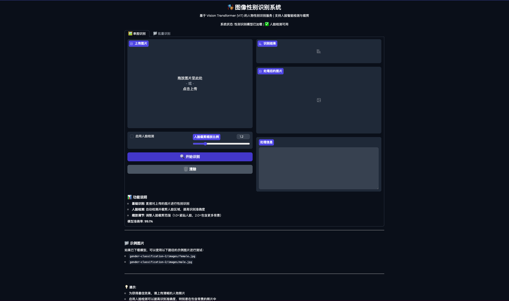
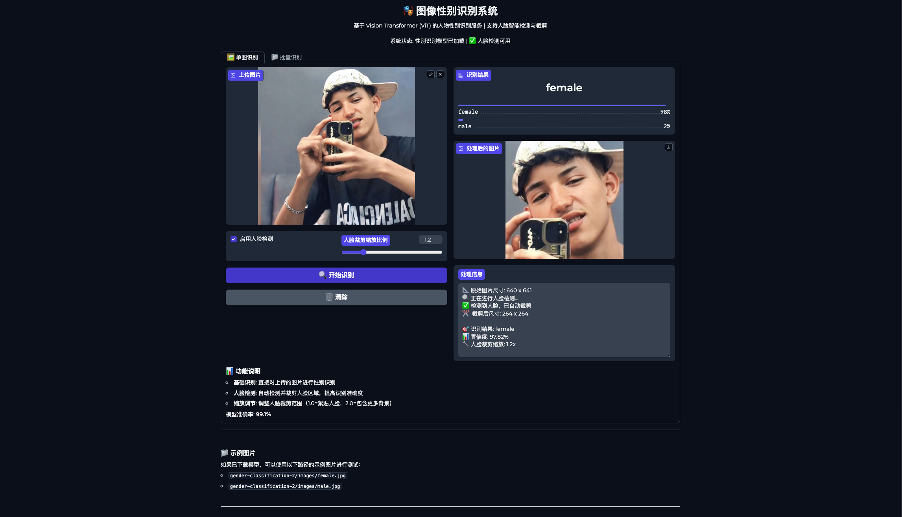

GenderLM 大模型 识别 图像中的性别

<div align="center">

**基于 Vision Transformer 的高精度性别识别系统**

[](https://www.python.org/downloads/)
[](https://pytorch.org/)
[](https://gradio.app/)
[](LICENSE)

[功能特性](#核心特性) • [快速开始](#快速开始) • [界面展示](#界面展示) • [API 文档](#方式三web-api-服务) • [性能说明](#性能说明)

</div>

---

## 项目简介

基于 Vision Transformer (ViT) 的人物性别识别系统，使用 Hugging Face 的 `rizvandwiki/gender-classification-2` 模型，准确率达到 **99.1%**。

**核心特性：**
- ✅ 高精度性别识别（99.1% 准确率）
- 🎯 智能人脸检测与裁剪（基于 InsightFace）
- 📦 支持批量图片处理
- ⚡ 队列系统管理并发请求
- 🌐 三种使用方式：CLI / API / WebUI

提供三种使用方式：
- 🖥️ **命令行工具** - 快速单图识别
- 🌐 **Web API** - RESTful API 服务（支持队列和批量处理）
- 🎨 **Gradio WebUI** - 可视化交互界面（支持单图和批量识别）

## 功能对比

| 功能 | CLI | API | WebUI |
|------|-----|-----|-------|
| 单图识别 | ✅ | ✅ | ✅ |
| 批量处理 | ❌ | ✅ | ✅ |
| 人脸检测 | ❌ | ✅ | ✅ |
| 队列系统 | ❌ | ✅ | ❌ |
| 可视化界面 | ❌ | ❌ | ✅ |
| 远程调用 | ❌ | ✅ | ✅ |
| 适用场景 | 快速测试 | 生产部署 | 演示/测试 |

## 快速开始

### 一键启动（推荐）

```bash
# 1. 克隆项目
git clone <your-repo-url>
cd GenderLM

# 2. 下载性别识别模型
git clone https://huggingface.co/rizvandwiki/gender-classification-2

# 3. 安装依赖
uv sync

# 4. 启动 WebUI（最简单）
python webui.py
# 访问 http://localhost:7860

# 或启动 API 服务
python api.py
# 访问 http://localhost:8000/docs 查看 API 文档
```

### Docker 启动（可选）

```bash
# 构建镜像
docker build -t genderlm .

# 运行容器
docker run -p 7860:7860 -p 8000:8000 genderlm
```

## 界面展示

### Gradio WebUI 界面

**主界面 - 单图识别**



**识别成功示例**



界面功能：
- 🖼️ 支持多种图片上传方式（拖拽、粘贴、摄像头）
- 🔍 可选启用人脸检测功能
- 🎚️ 可调节人脸裁剪缩放比例
- 📊 实时显示识别结果和置信度
- 🖼️ 展示处理后的裁剪图片
- 📁 支持批量图片处理

## 安装配置

### 1. 下载模型权重

```bash
# 性别识别模型（必需）
git clone https://huggingface.co/rizvandwiki/gender-classification-2

# 人脸检测模型（可选，首次运行会自动下载）
# InsightFace 模型会自动下载到 ~/.insightface/models/
```

### 2. 安装依赖

```bash
# 使用 uv (推荐)
uv sync

# 或使用 pip
pip install -e .
```

**依赖说明：**
- `torch` - PyTorch 深度学习框架
- `transformers` - Hugging Face 模型库
- `insightface` - 人脸检测和识别
- `onnxruntime` - ONNX 模型推理引擎
- `gradio` - WebUI 界面
- `fastapi` + `uvicorn` - API 服务

## 使用方法

### 方式一：命令行工具

```bash
python main.py <image_path>

# 示例
python main.py gender-classification-2/images/female.jpg
```

### 方式二：Gradio WebUI

启动可视化界面服务：

```bash
python webui.py
```

访问 http://localhost:7860 即可使用界面进行识别。

**功能特点：**
- 🖼️ **单图识别模式**
  - 支持拖拽/粘贴/摄像头上传图片
  - 可选启用人脸检测和智能裁剪
  - 调节人脸裁剪缩放比例（1.0-2.0）
  - 实时显示处理信息和裁剪后的图片

- 📁 **批量识别模式**
  - 支持同时上传多张图片
  - 批量应用人脸检测（可选）
  - 显示每张图片的识别结果和置信度

### 方式三：Web API 服务

启动 FastAPI 服务：

```bash
python api.py
```

或使用 uvicorn：

```bash
uvicorn api:app --host 0.0.0.0 --port 8000 --reload
```

**API 端点：**

#### 基础端点
- `GET /` - API 信息和功能列表
- `GET /health` - 健康检查（包含队列状态）
- `GET /queue/stats` - 队列统计信息
- `GET /docs` - API 文档（Swagger UI）

#### 预测端点
- `POST /predict` - 单张图片性别识别
- `POST /predict/batch` - 批量图片性别识别（后台队列处理）
- `GET /task/{task_id}` - 查询批量任务状��和结果

**调用示例：**

#### 1. 单张图片识别

```bash
# 基础识别（不使用人脸检测）
curl -X POST "http://localhost:8000/predict" \
  -F "file=@image.jpg"

# 启用人脸检测
curl -X POST "http://localhost:8000/predict?use_face_detection=true&face_scale=1.2" \
  -F "file=@image.jpg"
```

**Python 示例：**

```python
import requests

# 基础识别
with open("image.jpg", "rb") as f:
    response = requests.post(
        "http://localhost:8000/predict",
        files={"file": f}
    )
    print(response.json())

# 启用人脸检测
with open("image.jpg", "rb") as f:
    response = requests.post(
        "http://localhost:8000/predict",
        files={"file": f},
        params={"use_face_detection": True, "face_scale": 1.2}
    )
    result = response.json()
    print(f"Gender: {result['gender']}")
    print(f"Confidence: {result['confidence']}")
    print(f"Face detected: {result['face_detected']}")
```

**返回格式：**

```json
{
  "success": true,
  "gender": "female",
  "confidence": 0.9856,
  "probabilities": {
    "female": 0.9856,
    "male": 0.0144
  },
  "face_detected": true,
  "face_crop_applied": true,
  "original_size": [1024, 768],
  "cropped_size": [512, 512],
  "filename": "image.jpg"
}
```

#### 2. 批量图片识别

```bash
# 提交批量任务
curl -X POST "http://localhost:8000/predict/batch?use_face_detection=true" \
  -F "files=@image1.jpg" \
  -F "files=@image2.jpg" \
  -F "files=@image3.jpg"

# 返回：
# {
#   "success": true,
#   "task_id": "550e8400-e29b-41d4-a716-446655440000",
#   "files_count": 3,
#   "message": "任务已创建，正在后台处理",
#   "query_url": "/task/550e8400-e29b-41d4-a716-446655440000"
# }

# 查询任务状态
curl "http://localhost:8000/task/550e8400-e29b-41d4-a716-446655440000"
```

**Python 批量处理示例：**

```python
import requests
import time

# 提交批量任务
files = [
    ("files", open("image1.jpg", "rb")),
    ("files", open("image2.jpg", "rb")),
    ("files", open("image3.jpg", "rb"))
]

response = requests.post(
    "http://localhost:8000/predict/batch",
    files=files,
    params={"use_face_detection": True}
)

task_info = response.json()
task_id = task_info["task_id"]
print(f"Task ID: {task_id}")

# 轮询任务状态
while True:
    status_response = requests.get(f"http://localhost:8000/task/{task_id}")
    task_status = status_response.json()

    print(f"Status: {task_status['status']}, Progress: {task_status['processed_count']}/{task_status['files_count']}")

    if task_status["status"] in ["completed", "failed"]:
        break

    time.sleep(1)

# 获取结果
if task_status["status"] == "completed":
    for result in task_status["results"]:
        print(f"{result['filename']}: {result['gender']} ({result['confidence']:.2%})")
```

#### 3. 队列管理

```bash
# 查看队列统计
curl "http://localhost:8000/queue/stats"

# 返回：
# {
#   "total_tasks": 10,
#   "pending": 2,
#   "processing": 3,
#   "completed": 4,
#   "failed": 1,
#   "queue_capacity": 1000
# }

# 健康检查（含队列信息）
curl "http://localhost:8000/health"
```

## 人脸检测功能

### 功能说明

系统集成了 InsightFace 人脸检测模型，可以自动检测图片中的人脸并进行智能裁剪，提高性别识别的准确度。

**优势：**
- 自动定位人脸区域，排除背景干扰
- 支持调节裁剪范围（face_scale 参数）
- 未检测到人脸时自动回退到原图识别
- 同时支持单图和批量处理

**参数说明：**
- `use_face_detection` (bool): 是否启用人脸检测，默认 False
- `face_scale` (float): 人脸裁剪缩放比例，范围 1.0-2.0，默认 1.2
  - 1.0 = 紧贴人脸边界
  - 1.2 = 包含 20% 额外区域（推荐）
  - 2.0 = 包含更多背景

### 使用建议

- ✅ **推荐使用人脸检测**：包含背景或多人的照片
- ✅ **推荐使用人脸检测**：自拍或全身照
- ⚠️ **可选**：已经是纯人脸特写的照片
- ❌ **不建议**：图片质量很差或人脸模糊

## 模型说明

### 性别识别模型
- **模型**: Vision Transformer (ViT)
- **架构**: 12层 Transformer，768 隐藏层维度
- **输入**: 224×224 RGB 图像
- **输出**: 二分类（female/male）
- **准确率**: 99.1%
- **来源**: [rizvandwiki/gender-classification-2](https://huggingface.co/rizvandwiki/gender-classification-2)

### 人脸检测模型
- **模型**: InsightFace buffalo_s
- **功能**: 人脸检测、关键点定位
- **检测尺寸**: 640×640
- **运行环境**: CPU / CUDA

## 技术栈

- Python 3.12+
- PyTorch 2.9.1+
- Transformers 4.57.1+
- InsightFace 0.7.3+ (人脸检测)
- ONNX Runtime 1.23.2+ (人脸检测推理)
- Gradio 3.36.1+ (WebUI)
- FastAPI 0.121.1+ (Web API)
- Uvicorn 0.38.0+ (ASGI 服务器)

## 项目结构

```
GenderLM/
├── main.py                      # 命令行工具入口
├── api.py                       # FastAPI 服务（带队列系统）
├── webui.py                     # Gradio Web 界面
├── face_detector.py             # 人脸检测模块（InsightFace）
├── pyproject.toml               # 项目依赖配置
├── README.md                    # 项目文档
├── CLAUDE.md                    # Claude Code 开发文档
├── docs/                        # 文档和截图
│   ├── gradio页面.png          # WebUI 主界面截图
│   └── gradio识别成功.png      # 识别成功示例
└── gender-classification-2/     # 性别识别模型（需下载）
    ├── config.json              # 模型配置
    ├── model.safetensors        # 模型权重
    ├── preprocessor_config.json # 预处理配置
    └── images/                  # 示例图片
        ├── male.jpg
        └── female.jpg
```

### 核心模块说明

- **main.py**: 命令行工具，支持快速单图识别
- **api.py**:
  - RESTful API 服务
  - 内置任务队列系统（支持 1000 个并发任务）
  - 支持单图和批量识别
  - 可选人脸检测功能
- **webui.py**:
  - Gradio 可视化界面
  - 单图识别 + 批量识别两个 Tab
  - 实时显示处理信息和裁剪结果
- **face_detector.py**:
  - InsightFace 人脸检测封装
  - 支持人脸检测、定位和裁剪
  - 可调节检测阈值（det_thresh）

## 队列系统

API 服务内置任务队列系统，支持高并发批量处理：

**特性：**
- 最大队列容量：1000 个任务
- 自动后台处理
- 实时进度查询
- 失败任务重试机制
- 历史记录保留（最近 100 个）

**任务状态：**
- `pending` - 等待处理
- `processing` - 正在处理
- `completed` - 处理完成
- `failed` - 处理失败

## 性能说明

**处理速度（CPU）：**
- 单图识别（无人脸检测）：~100-200ms
- 单图识别（含人脸检测）：~500-800ms
- 批量处理：根据队列并发自动调度

**资源占用：**
- 性别识别模型：~330MB
- 人脸检测模型：~60MB
- 总内存占用：~500MB-1GB

## 注意事项

- 模型默认使用本地路径 `./gender-classification-2`
- 如果本地模型不存在，会自动从 Hugging Face 下载
- InsightFace 模型首次运行时会自动下载到 `~/.insightface/models/`
- 首次运行需要等待模型加载（约 10-30 秒）
- 人脸检测功能可选，如果加载失败会自动禁用
- 为获得最佳效果，建议上传清晰的人物照片
- 批量处理建议每次不超过 100 张图片

## 故障排查

### 人脸检测功能不可用

如果遇到 "人脸检测功能不可用" 的提示：

```bash
# 确认 InsightFace 已正确安装
pip install insightface onnxruntime

# 手动下载人脸检测模型
python -c "from insightface.app import FaceAnalysis; app = FaceAnalysis(name='buffalo_s'); app.prepare(ctx_id=0)"
```

### GPU 加速（可选）

如果有 NVIDIA GPU，可以安装 CUDA 版本的 ONNX Runtime：

```bash
pip uninstall onnxruntime
pip install onnxruntime-gpu
```

### 人脸检测阈值调优

如果发现某些图片检测不到人脸，可以调整检测阈值：

```python
# 在代码中调整
from face_detector import FaceDetector

# 更敏感的检测（阈值越低越敏感）
detector = FaceDetector(det_thresh=0.3)  # 默认 0.4

# 更严格的检测（减少误报）
detector = FaceDetector(det_thresh=0.6)
```

**调优建议：**
- 检测不到人脸 → 降低阈值 (0.3, 0.2)
- 误报太多 → 提高阈值 (0.6, 0.7)
- 推荐值：0.4（已在 API 和 WebUI 中设置）

## 使用场景

### 适用场景
- ✅ **社交媒体**: 用户头像性别分类
- ✅ **市场调研**: 受众性别分析
- ✅ **内容审核**: 辅助人工审核
- ✅ **数据标注**: 批量图片标注
- ✅ **学术研究**: 性别识别研究

### 最佳实践

1. **图片质量要求**
   - 推荐分辨率：≥224×224
   - 人脸清晰可见
   - 光照均匀，无严重阴影

2. **批量处理建议**
   - 单次上传 ≤100 张图片
   - 启用人脸检测提高准确率
   - 使用 API 的批量端点进行大规模处理

3. **性能优化**
   - CPU 环境：关闭人脸检测可提速 3-4 倍
   - GPU 环境：安装 onnxruntime-gpu 加速
   - 大批量任务：使用 API 队列系统

## 常见问题 (FAQ)

<details>
<summary><b>Q: 为什么某些图片检测不到人脸？</b></summary>

**A:** 可能原因及解决方案：
1. **检测阈值过高** → 降低 det_thresh 到 0.3 或 0.2
2. **人脸角度** → 侧脸、低头可能检测失败，尝试正面照
3. **图片质量** → 确保图片清晰，人脸可见
4. **遮挡** → 避免帽子、口罩等严重遮挡
5. **人脸过小** → 确保人脸占图片至少 10% 以上

如果仍无法检测，可以关闭人脸检测，直接使用原图识别。
</details>

<details>
<summary><b>Q: 如何提高识别准确率？</b></summary>

**A:** 建议：
1. ✅ 启用人脸检测功能
2. ✅ 使用清晰的正面照
3. ✅ 确保良好的光照条件
4. ✅ 人脸裁剪缩放比例设置为 1.2-1.5
5. ✅ 避免严重遮挡或滤镜
</details>

<details>
<summary><b>Q: API 支持多大规模的批量处理？</b></summary>

**A:**
- 单次请求最多 100 张图片
- 队列容量最大 1000 个任务
- 建议每次 20-50 张以获得最佳性能
- 大规模处理可以分批多次调用
</details>

<details>
<summary><b>Q: 如何在生产环境部署？</b></summary>

**A:** 推荐方案：
1. **Docker 部署** (推荐)
   ```bash
   docker build -t genderlm .
   docker run -d -p 8000:8000 genderlm
   ```

2. **Systemd 服务** (Linux)
   ```bash
   # 创建 systemd 服务文件
   sudo nano /etc/systemd/system/genderlm.service

   # 启动服务
   sudo systemctl start genderlm
   sudo systemctl enable genderlm
   ```

3. **Nginx 反向代理**
   - 配置 Nginx 代理到 localhost:8000
   - 添加 SSL 证书
   - 配置负载均衡（多实例）
</details>

<details>
<summary><b>Q: 支持哪些图片格式？</b></summary>

**A:** 支持所有常见图片格式：
- ✅ JPG/JPEG
- ✅ PNG
- ✅ BMP
- ✅ WEBP
- ✅ TIFF

所有格式会自动转换为 RGB 格式处理。
</details>

<details>
<summary><b>Q: 可以离线使用吗？</b></summary>

**A:** 可以！
1. 预先下载性别识别模型到本地
2. 首次运行时会自动下载 InsightFace 模型
3. 之后可完全离线使用
4. 无需联网，保护数据隐私
</details>

## 更新日志

### v2.0.0 (2025-01-13)
- ✨ 新增人脸检测功能（InsightFace）
- ✨ 新增批量图片处理
- ✨ 新增任务队列系统
- ✨ WebUI 支持单图/批量两种模式
- 🐛 修复 JPG 格式人脸检测问题（RGB/BGR 转换）
- 🔧 优化检测阈值（默认 0.4）
- 📝 完善文档和使用说明

### v1.0.0 (Initial Release)
- 基础性别识别功能
- 命令行工具
- FastAPI 服务
- Gradio WebUI

## 许可证

本项目使用的模型：
- 性别识别模型：遵循 Hugging Face 模型许可
- InsightFace：遵循其开源许可

## 鸣谢

- [rizvandwiki/gender-classification-2](https://huggingface.co/rizvandwiki/gender-classification-2) - 提供高精度性别识别模型
- [InsightFace](https://github.com/deepinsight/insightface) - 提供优秀的人脸检测和识别解决方案
- [Hugging Face](https://huggingface.co/) - 提供模型托管和 Transformers 库
- [Gradio](https://gradio.app/) - 提供简洁易用的 WebUI 框架
- [FastAPI](https://fastapi.tiangolo.com/) - 提供高性能的 API 框架

## 贡献

欢迎提交 Issue 和 Pull Request！

### 如何贡献

1. Fork 本项目
2. 创建功能分支 (`git checkout -b feature/AmazingFeature`)
3. 提交更改 (`git commit -m 'Add some AmazingFeature'`)
4. 推送到分支 (`git push origin feature/AmazingFeature`)
5. 开启 Pull Request

### 贡献指南

- 保持代码风格一致
- 添加必要的测试
- 更新相关文档
- 遵循语义化版本规范

## 联系方式

如有问题或建议，欢迎通过以下方式联系：

- 📧 Email: [your-email@example.com]
- 💬 Issue: [GitHub Issues](your-repo-url/issues)
- 🐦 Twitter: [@your-twitter]

---

<div align="center">

**⭐ 如果这个项目对您有帮助，请给个 Star！**

Made with ❤️ by [Your Name]

</div>

