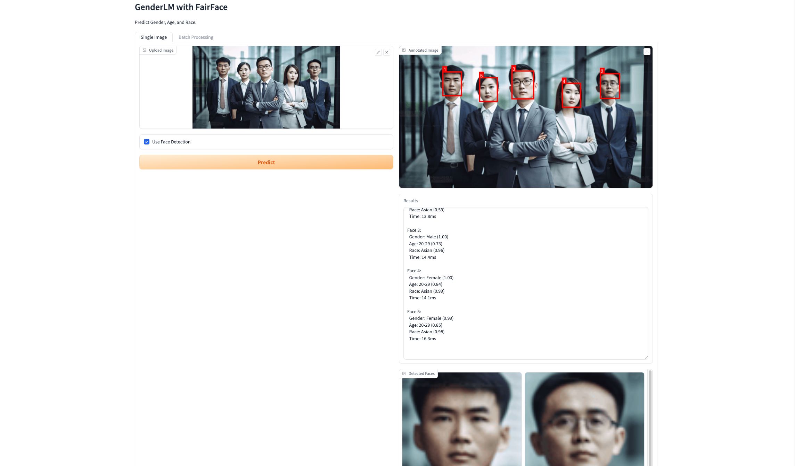

<div align="center">

**基于 FairFace 的多属性人脸分析系统**

[](https://www.python.org/downloads/)
[](https://pytorch.org/)
[](https://gradio.app/)
[](LICENSE)

[功能特性](#核心特性) • [快速开始](#快速开始) • [界面展示](#界面展示) • [API 文档](#方式三web-api-服务) • [性能说明](#性能说明)

</div>

---

## 项目简介

基于 FairFace (ResNet34) 的人脸属性分析系统，能够同时预测**性别、年龄和人种**。

**核心特性：**
- ✅ 多属性识别：性别、年龄段、人种
- 🎯 智能人脸检测与裁剪（基于 InsightFace）
- 📦 支持批量图片处理
- ⚡ 高性能同步 API
- 🌐 三种使用方式：CLI / API / WebUI

提供三种使用方式：
- 🖥️ **命令行工具** - 快速单图/目录识别
- 🌐 **Web API** - RESTful API 服务
- 🎨 **Gradio WebUI** - 可视化交互界面

## 功能对比

| 功能 | CLI | API | WebUI |
|------|-----|-----|-------|
| 单图识别 | ✅ | ✅ | ✅ |
| 批量处理 | ✅ | ✅ | ✅ |
| 人脸检测 | ✅ | ✅ | ✅ |
| 属性预测 | 性别/年龄/人种 | 性别/年龄/人种 | 性别/年龄/人种 |
| 可视化界面 | ❌ | ❌ | ✅ |

## 快速开始

### 一键启动（推荐）

```bash
# 1. 克隆项目
git clone https://github.com/Anning01/genderlm.git
cd GenderLM

# 2. 安装依赖
uv sync  # 或者 pip install -r requirements.txt

# 3. 启动 WebUI（最简单）
uv run webui.py 或者 python webui.py
# 访问 http://localhost:7860

# 或启动 API 服务（可选）
uv run api.py 或者 python api.py
# 访问 http://localhost:8000/docs 查看 API 文档
```

## 界面展示

### Gradio WebUI 界面

支持单图识别和批量处理，实时显示性别、年龄和人种预测结果，并提供人脸检测可视化。

## 安装配置

### 1. 下载模型权重

FairFace 模型 `res34_fair_align_multi_7_20190809.pt` 应位于 `models/` 目录下。

### 2. 安装依赖

```bash
# 使用 uv (推荐)
uv sync

# 或使用 pip
pip install -e .
```

**依赖说明：**
- `torch`, `torchvision` - 深度学习框架
- `insightface`, `opencv-python` - 人脸检测
- `gradio` - WebUI 界面
- `fastapi` + `uvicorn` - API 服务

## 使用方法

### 方式一：命令行工具

```bash
# 单图识别
python main.py path/to/image.jpg

# 启用人脸检测和裁剪
python main.py path/to/image.jpg --crop

# 批量识别（目录）
python main.py path/to/directory --crop

# 输出 JSON 格式
python main.py path/to/image.jpg --crop --json
```

### 方式二：Gradio WebUI

启动可视化界面服务：

```bash
python webui.py
```
**主界面 - 单图识别**


**识别成功示例**



访问 http://localhost:7860 即可使用界面进行识别。

### 方式三：Web API 服务

启动 FastAPI 服务：

```bash
python api.py
```

**API 端点：**

#### 基础端点
- `GET /health` - 健康检查

#### 预测端点
- `POST /predict` - 单张图片识别
  - 参数：
    - `file`: 图片文件
    - `use_face_detection`: boolean (默认 False)
    - `return_face_image`: boolean (默认 False, 返回裁剪后的 base64 图片)
- `POST /predict_mult` - 批量图片识别 (Max 50)
  - 参数同上，`file` 改为 `files`

**调用示例：**

```bash
# 单图识别
curl -X POST "http://localhost:8000/predict" \
  -F "file=@image.jpg" \
  -F "use_face_detection=true"

# 批量识别
curl -X POST "http://localhost:8000/predict_mult" \
  -F "files=@image1.jpg" \
  -F "files=@image2.jpg"
```

## 模型说明

### 属性识别模型 (FairFace)
- **模型**: ResNet34
- **输出**: 
  - 性别: Male, Female
  - 年龄: 0-2, 3-9, 10-19, 20-29, 30-39, 40-49, 50-59, 60-69, 70+
  - 人种: White, Black, Latino, Asian, Southeast Asian, Indian, Middle Eastern

### 人脸检测模型
- **模型**: InsightFace buffalo_s

## 更新日志

### v3.0.0 (2025-11-24)
- 🚀 核心模型升级为 FairFace，支持性别、年龄、人种预测
- ✨ 重构 API，支持同步运行和 Base64 返回
- ✨ 重构 CLI，支持目录批量处理和 JSON 输出
- ✨ 重构 WebUI，适配新模型属性展示

### v2.0.0 (2025-01-13)
- ✨ 新增人脸检测功能（InsightFace）
- ✨ 新增批量图片处理

### v1.0.0 (Initial Release)
- 基础性别识别功能 (ViT)

## 许可证

本项目使用的模型遵循其各自的许可协议。

## 联系方式

- 📧 Email: [anningforchina@gmail.com]
- 💬 Issue: [GitHub Issues](https://github.com/Anning01/genderlm/issues)

---

<div align="center">

**⭐ 如果这个项目对您有帮助，请给个 Star！**

Made with ❤️ by [Anning]

</div>

